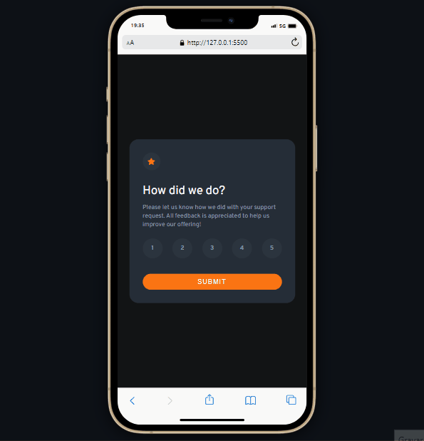

# Interactive Rating Component

## Bem-vindos! 👋

Este projeto foi desenvolvido para o desafio do Frontend Mentor, cujo objetivo principal é construir um aplicativo de um componente de classificação interativa.

## Funcionalidades

Para usar o componente, basta clicar nas estrelas para selecionar a classificação desejada.

Quando o usuário seleciona uma classificação, o JavaScript registra a alteração e a classificação selecionada pode ser enviada para o servidor ou usada para outras funcionalidades no aplicativo.

## Tecnologias utilizadas

- Marcação HTML5 semântica
- Propriedades personalizadas CSS
- Flexbox
- JavaScript

## Como executar o projeto

1. Faça o download ou clone este repositório.

- git clone https://vandesonsantos.github.io/interactive-rating-component/

2. Abra o arquivo `index.html` em seu navegador web.

## Inspiração

Este componente foi desenvolvido como parte de um desafio do Frontend Mentor. Você pode encontrar mais detalhes sobre o desafio [aqui](https://www.frontendmentor.io/challenges).

## Contribuindo

Contribuições são sempre bem-vindas! Se você deseja contribuir com este projeto, siga as etapas abaixo:

- Faça um fork deste repositório.
- Crie um novo branch com a sua contribuição.
- Faça as modificações desejadas.
- Envie um pull request com as suas alterações.

## Deploy project

- [GitHub Pages](https://vandesonsantos.github.io/interactive-rating-component/)

**Divirta-se!** 🚀
